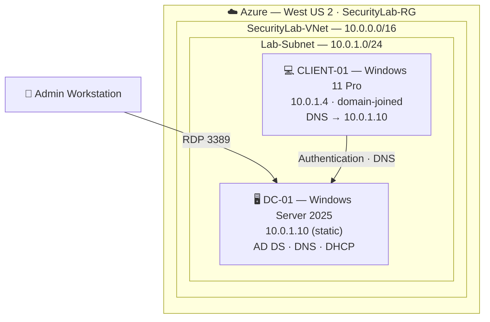

[README.md](https://github.com/user-attachments/files/29616908/README.md)
# Windows Server 2025 Active Directory Domain Controller Lab


A hands-on lab building a complete Active Directory environment in Microsoft Azure — a Windows Server 2025 domain controller, a domain-joined Windows 11 client, and everything in between: domain services, DNS, DHCP, organizational structure, Group Policy, and baseline security hardening. Built and verified end to end, from an empty VM to a client authenticating a domain user.

> **Why this lab exists:** Active Directory is the backbone of identity in most enterprises, which also makes it one of the most attacked systems in existence — nearly every major ransomware incident involves compromising AD. Building and hardening a domain from scratch is the foundation for everything from incident response to privileged access management. This is **Lab 1** of a three-part security portfolio and the base the [AD Security Hardening + SIEM lab](#-related-projects) is built on top of.

---

## 📋 Project Status

| Phase | Description | Status |
|------|-------------|:------:|
| 1 | Azure foundation — Resource Group & Virtual Network | ✅ Complete |
| 2 | Deploy DC-01 (Windows Server 2025 VM) + static IP | ✅ Complete |
| 3 | Promote to Domain Controller (AD DS + DNS) | ✅ Complete |
| 4 | Active Directory structure (OUs, users, groups) | ✅ Complete |
| 5 | DHCP role and scope | ✅ Complete |
| 6 | Group Policy Objects | ✅ Complete |
| 7 | Security hardening | ✅ Complete |
| 8 | Domain-join a client and verify end to end | ✅ Complete |

---

## 🎯 Objectives

- Stand up a Windows Server 2025 domain controller in a cloud environment
- Design and implement Active Directory Domain Services (AD DS), DNS, and DHCP
- Build a realistic organizational structure with OUs, users, and security groups
- Enforce security policy through Group Policy Objects (GPOs)
- Apply a baseline hardening configuration aligned to security best practices
- Configure audit logging that feeds into a SIEM for the follow-on detection lab
- Join a Windows 11 client to the domain and prove authentication works end to end
- Document the entire build to a professional, reproducible standard

## 🛠️ Skills Demonstrated

Identity & access management · Active Directory administration · DNS and DHCP configuration · Group Policy management · Windows Server hardening · Domain join & Kerberos authentication · Network segmentation · Cloud infrastructure (Azure IaaS) · PowerShell automation · Security auditing · Technical documentation

---

## 🏗️ Lab Architecture



### Network plan

| Resource | Type | Address | Notes |
|----------|------|---------|-------|
| `SecurityLab-VNet` | Virtual Network | `10.0.0.0/16` | Lab address space |
| `Lab-Subnet` | Subnet | `10.0.1.0/24` | Azure reserves `.0–.3` and `.255`; first usable IP is `.4` |
| `DC-01` | Domain Controller | `10.0.1.10` (static) | Hosts AD DS, DNS, DHCP |
| DHCP scope | Client pool | `10.0.1.100 – 10.0.1.200` | See [Azure DHCP note](#a-note-on-dhcp-in-azure) |
| `CLIENT-01` | Member workstation | `10.0.1.4` | Windows 11, domain-joined, DNS pointed at DC-01 |

### Identity plan

- **Forest / Domain:** `corp.local` (NetBIOS: `CORP`)
- **Functional level:** Windows Server 2025
- **DNS:** AD-integrated, hosted on DC-01
- **Sample identity:** user `jdoe` (Jane Doe), member of the `IT-Admins` security group

> 🔒 **Security note:** `.local` is used here because the lab is fully isolated from the internet. In production I would use a delegated subdomain of a registered domain (for example `ad.example.com`) to avoid name-resolution conflicts and to support certificate services. Calling this out is intentional — it's a real design decision, not an oversight.

---

## 🧰 Tools & Technologies

| Tool | Purpose |
|------|---------|
| Microsoft Azure (IaaS) | Cloud hosting for the lab VMs and network |
| Windows Server 2025 Datacenter | Domain controller operating system |
| Windows 11 Pro | Domain-joined client for testing |
| Active Directory Domain Services | Centralized identity and authentication |
| DNS Server | Name resolution for the domain |
| DHCP Server | Dynamic addressing for clients |
| Group Policy Management Console | Centralized policy enforcement |
| PowerShell | Automation and verification |

## ✅ Prerequisites

- An Azure subscription (this lab was built on free-tier credit)
- A budget alert configured in Azure Cost Management before deploying any VM
- RDP client (built into Windows; Microsoft Remote Desktop on macOS)
- Basic comfort with the Azure portal and PowerShell

---

## 🔧 Build Documentation

### Phase 1 — Azure Foundation

Created the resource group and virtual network that contain every lab resource. Building these first means the entire lab can be torn down cleanly by deleting a single resource group.

**Resource Group:** `SecurityLab-RG` · **Region:** `West US 2`
**Virtual Network:** `SecurityLab-VNet` → `10.0.0.0/16`, subnet `Lab-Subnet` → `10.0.1.0/24`


**Confirmed:** `SecurityLab-VNet` shows `Lab-Subnet` (`10.0.1.0/24`) under **Subnets**.

---

### Phase 2 — Deploy DC-01

Deployed a Windows Server 2025 VM to serve as the domain controller, then reserved its private IP as static so DNS never breaks from an address change.

| Setting | Value |
|---------|-------|
| VM name | `DC-01` |
| Image | Windows Server 2025 Datacenter: Azure Edition – Gen2 |
| Size | Standard B2as v2 (2 vCPU, 8 GiB) |
| Admin username | `labadmin` |
| Network | `SecurityLab-VNet` / `Lab-Subnet` |
| Private IP | `10.0.1.10` (static) |

The static assignment was set on the NIC: `DC-01 → Network settings → NIC → IP configurations → ipconfig1 → Static → 10.0.1.10`.


**Confirmed:** Private IPv4 address shows **10.0.1.10 (Static)**.

---

### Phase 3 — Promote to Domain Controller

Installed the AD DS role and promoted DC-01 to the first domain controller in a new forest, with DNS installed alongside it.

```powershell
# Install the AD DS role and management tools
Install-WindowsFeature -Name AD-Domain-Services -IncludeManagementTools

# Promote to a new forest / domain (server reboots on completion)
Install-ADDSForest `
    -DomainName "corp.local" `
    -DomainNetbiosName "CORP" `
    -InstallDns:$true `
    -Force
```

**Confirmed** (after reboot, logged in as `CORP\labadmin`):

```powershell
Get-ADDomain | Select-Object DNSRoot, NetBIOSName, DomainMode
Get-Service ADWS, KDC, Netlogon, DNS | Select-Object Name, Status
```

Result: `corp.local` / `CORP` / `Windows2025Domain`, with ADWS, KDC, Netlogon, and DNS all **Running**.


---

### Phase 4 — Active Directory Structure

Built a clean OU hierarchy, a security group, and a sample user — the structure GPOs and access control are applied against.

```powershell
# OU hierarchy
New-ADOrganizationalUnit -Name "Corp" -Path "DC=corp,DC=local"
"Users","Workstations","Servers","Groups" | ForEach-Object {
    New-ADOrganizationalUnit -Name $_ -Path "OU=Corp,DC=corp,DC=local"
}

# Security group
New-ADGroup -Name "IT-Admins" -GroupScope Global -GroupCategory Security `
    -Path "OU=Groups,OU=Corp,DC=corp,DC=local"

# Sample user
New-ADUser -Name "Jane Doe" -GivenName "Jane" -Surname "Doe" `
    -SamAccountName "jdoe" -UserPrincipalName "jdoe@corp.local" `
    -Path "OU=Users,OU=Corp,DC=corp,DC=local" `
    -AccountPassword (ConvertTo-SecureString "TempP@ssw0rd!" -AsPlainText -Force) `
    -ChangePasswordAtLogon $true -Enabled $true

# Group membership
Add-ADGroupMember -Identity "IT-Admins" -Members "jdoe"
```

**Confirmed:** `Get-ADGroupMember "IT-Admins"` returns **Jane Doe**.


---

### Phase 5 — DHCP

Installed and authorized the DHCP role and created a scope for client machines.

```powershell
Install-WindowsFeature -Name DHCP -IncludeManagementTools
Add-DhcpServerInDC -DnsName "DC-01.corp.local" -IPAddress 10.0.1.10

Add-DhcpServerv4Scope -Name "Lab-Scope" `
    -StartRange 10.0.1.100 -EndRange 10.0.1.200 `
    -SubnetMask 255.255.255.0 -State Active

Set-DhcpServerv4OptionValue -ScopeId 10.0.1.0 `
    -DnsServer 10.0.1.10 -DnsDomain "corp.local" -Router 10.0.1.1
```

**Confirmed:** `Get-DhcpServerv4Scope` shows `10.0.1.0` / `Lab-Scope` / **Active**.

#### A note on DHCP in Azure

Azure's platform provides DHCP for the virtual network and intercepts DHCP traffic, so Azure VMs receive their addresses from the Azure fabric rather than a Windows DHCP server on the same subnet. In this cloud-hosted lab the DHCP role is configured to **demonstrate the skill and validate the configuration**, while clients continue to pull from Azure. In an on-prem or fully isolated environment (Hyper-V/VMware with an internal switch), this same DHCP server would serve clients directly. Knowing where the boundary is matters more than pretending it isn't there.


---

### Phase 6 — Group Policy

Authored GPOs to enforce a security baseline. A dedicated **Security Baseline** GPO was created and linked to the Corp OU; domain-wide password rules were set in the **Default Domain Policy** (the only place domain password policy takes effect).

```powershell
New-GPO -Name "Security Baseline" | New-GPLink -Target "OU=Corp,DC=corp,DC=local"
```

| Policy | Setting | Location |
|--------|---------|----------|
| Machine inactivity limit | 600 seconds (auto-lock) | Security Baseline |
| Removable storage — deny all access | Enabled (blocks USB storage) | Security Baseline |
| Minimum password length | 14 characters | Default Domain Policy |
| Password complexity | Enabled | Default Domain Policy |
| Maximum password age | 90 days | Default Domain Policy |

> The audit policy set in Phase 7 is deliberate groundwork — those logon (4624/4625) and account-management events are the exact telemetry the SIEM ingests in Lab 2.


---

### Phase 7 — Security Hardening

Applied baseline hardening to reduce the attack surface.

```powershell
# Remove the legacy SMBv1 protocol (the vector WannaCry spread through)
Disable-WindowsOptionalFeature -Online -FeatureName SMB1Protocol -NoRestart

# Confirm Windows Firewall is enabled on all profiles
Set-NetFirewallProfile -Profile Domain,Public,Private -Enabled True

# Enable security auditing (feeds the SIEM in Lab 2)
auditpol /set /category:"Logon/Logoff" /success:enable /failure:enable
auditpol /set /category:"Account Management" /success:enable /failure:enable
```

**Confirmed:** SMBv1 reports **DisabledWithPayloadRemoved** — the feature code is gone entirely, not just switched off.


---

### Phase 8 — Domain Join & End-to-End Verification

Deployed a Windows 11 client, pointed its DNS at the domain controller, joined it to `corp.local`, and logged in as a domain user — proving the whole environment works end to end.

**1. Point the client's DNS at the DC** (so it can find the domain): set `CLIENT-01` NIC DNS to `10.0.1.10`, then reboot.

**2. Join the domain** (run on CLIENT-01):

```powershell
$cred = Get-Credential   # CORP\labadmin
Add-Computer -DomainName "corp.local" -Credential $cred -Restart
```

**3. Authorize the domain user for remote login:** added `CORP\jdoe` to the client's **Remote Desktop Users** group (standard users can't RDP by default).

**4. Log in as the domain user** `CORP\jdoe` — Windows built Jane a fresh profile on first logon, confirming the client trusts the DC.

**5. Confirm policy reached the client:**

```cmd
gpresult /r
```

**Results:**
- ✅ CLIENT-01 joined `corp.local` and authenticated with a domain account
- ✅ Domain user `jdoe` logged in with a fresh profile generated on the client
- ✅ The 14-character password policy was enforced during a password reset (see Challenges)


> **What this proves:** CLIENT-01 stores no account for Jane. When she logs in, the client asks DC-01 to validate her via Kerberos, the DC confirms against Active Directory, and only then is she granted a session. That "ask the domain controller" handshake is the entire purpose of a domain — and Kerberos is also a prime target for AD attacks (Kerberoasting, golden tickets), which is exactly what Lab 2 explores.

---

## 🧯 Challenges & Troubleshooting

Real issues hit during the build and how they were resolved. These are the parts that turn a walkthrough into experience.

**VM size unavailable in an availability zone.** `Standard_B2s` failed to deploy in Zone 1 of West US 2. Since a single-VM lab needs no zone, set **Availability options → No infrastructure redundancy required** to drop the zone pin, and the size became selectable.

**Password policy blocked a weak password — as designed.** When resetting the domain user's password, a 13-character value was rejected by Active Directory. This was the **14-character minimum policy built in Phase 6 actively enforcing itself** — the control working exactly as intended. Resolved by supplying a compliant password. A great example of a security control catching a weak credential in real time.

**DSRM password rejected for complexity.** `Install-ADDSForest` refused the initial Directory Services Restore Mode password for not meeting complexity requirements. Supplied a stronger password (upper, lower, number, symbol) and promotion succeeded.

**Domain user denied remote login.** After the domain join, `CORP\jdoe` was blocked from RDP with "not authorized for remote login." By default only administrators can RDP; resolved by adding the user to the client's **Remote Desktop Users** group.

**New-subscription spending limit blocked the client VM.** Deploying a Windows client OS failed with a subscription spending-limit restriction. Resolved by upgrading the subscription to pay-as-you-go to lift the limit (free credit still applies first).

**Azure directory/tenant mismatch.** A new Azure account threw a subscription/region restriction on first deployment. Root cause was a tenant/directory mismatch; resolved by switching to the correct directory so the subscription and resources lived in the same tenant. Takeaway: when everything looks configured but deployment fails, confirm the **directory context** before assuming a quota or billing problem.

---

## 💰 Cost Management

The entire lab — two VMs, all phases — cost **under $5** in Azure credit by following one discipline: **Stop (deallocate) every VM at the end of each session.** VNets, subnets, and resource groups are free while idle; only running compute is billed. The whole environment tears down by deleting the `SecurityLab-RG` resource group.

---

## 🎓 Mapping to CompTIA Security+ (SY0-701)

| Lab work | Security+ domain |
|----------|------------------|
| AD identity, groups, least privilege, Kerberos auth | 1 — General Security Concepts (IAM) |
| SMBv1 removal, account/USB hardening | 2 — Threats, Vulnerabilities & Mitigations |
| VNet segmentation, DNS/DHCP design | 3 — Security Architecture |
| Audit logging, GPO baseline, monitoring | 4 — Security Operations |
| Documented, repeatable build standard | 5 — Security Program Management |

---

## 🔗 Related Projects

This is **Lab 1 of 3** in a hands-on security portfolio:

1. **Windows Server 2025 Domain Controller** *(this lab)* — the identity foundation ✅
2. **AD Security Hardening + SIEM** — Wazuh, Sysmon, and BloodHound for detection and attack-path analysis *(capstone, builds on this lab)*
3. **Cisco Packet Tracer Enterprise Network** — VLANs, ASA firewall, DMZ, and site-to-site VPN

---

## 📁 Repository Structure

```
.
├── README.md
└── screenshots/
    ├── phase1-vnet.png
    ├── phase2-dc01-running.png
    ├── phase3-addomain.png
    ├── phase4-ou-structure.png
    ├── phase5-dhcp-scope.png
    ├── phase6-gpo.png
    ├── phase7-hardening.png
    └── phase8-verification.png
```

---

*Documented by Isaiah Roberts — CompTIA Security+ | building toward SOC analyst and cloud security administration.*
